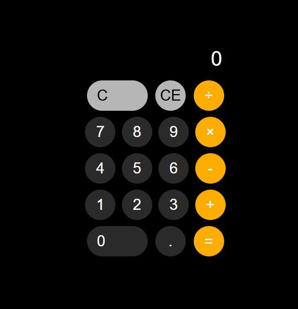

# 📱 iPhone-Style Calculator

A fully functional **Calculator App** inspired by the classic **iPhone calculator**. Built using **HTML**, **CSS**, and **JavaScript**, this app features a sleek UI, responsive layout, and supports basic arithmetic operations with dynamic interaction.

 <!-- Add an actual screenshot here -->

---

## 🔧 Features

- 🧮 Performs addition, subtraction, multiplication, and division
- 🔄 Clear (AC), decimal, and backspace functionality
- 🎯 Responsive layout — works on mobile and desktop
- 🖤 iOS-style theme (dark background with orange highlights)
- 🧠 Keyboard input support (optional, if implemented)
- ⚙️ Built entirely with vanilla JavaScript — no libraries or frameworks

---

## 📁 Project Structure

calculator-app/
├── index.html # Markup for the calculator layout
├── style.css # CSS for iPhone-like styling
├── script.js # JavaScript logic for calculator functionality
└── screenshot.png # screenshot of the calculator UI
